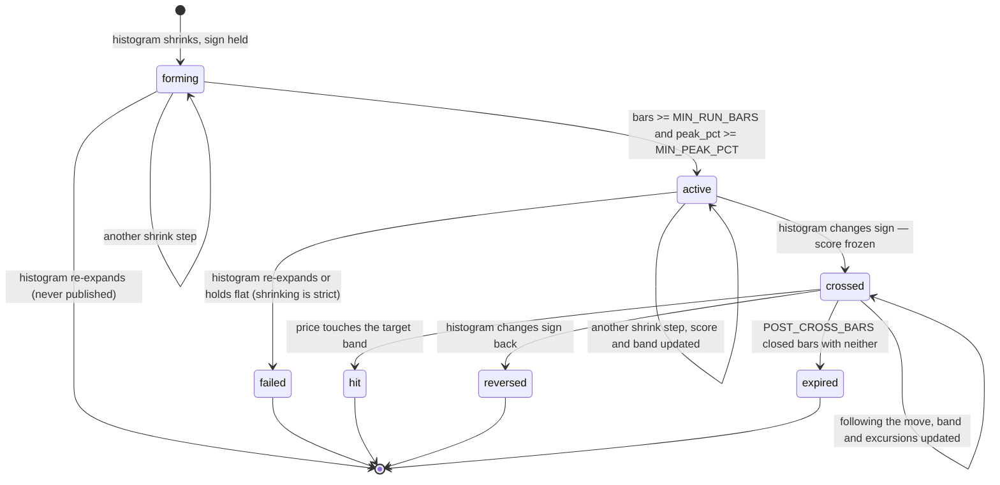

# Live MACD Contraction Searcher — Design

## 1. What it does

A single long-running process that watches **Hyperliquid** perps on the **1-hour
timeframe**, refreshing every **10 minutes**, and continuously reports every
**contraction window**: a run of consecutive closed bars where the MACD histogram is
shrinking toward zero without changing sign. The universe is the core crypto perps
plus the HIP-3 `xyz` markets (equities, indices, commodities, FX) — the platform the
windows would actually be traded on.

A shrinking histogram means the dominant side is losing its grip. The window is the
*lead-up* to a MACD cross, not the cross itself — the point of the app is to be
looking at the setup while it is still forming. When the cross does come, the window
is **followed through it**: the app keeps watching until price either reaches the
opposite Bollinger band (the move was granted), the histogram flips back (it was not),
or enough time passes that the move can no longer be credited to this cross.

**Bollinger Bands** supply the price-side context. A histogram contraction says
momentum is turning; whether price is still deep on the losing side of its 20-bar
mean, sitting just under it, or already through it says how much of the move is
confirmed and how much is hope.

## 2. The signal

Standard MACD on 1-hour closes:

```
macd   = EMA(close, 12) - EMA(close, 26)
signal = EMA(macd, 9)
hist   = macd - signal
```

A **window** is a maximal run of closed bars in which `hist` keeps the same sign and
`abs(hist)` strictly decreases bar over bar.

| Histogram         | Direction of travel | Side        | Reading                                                       |
| ----------------- | ------------------- | ----------- | ------------------------------------------------------------- |
| negative, shrinking | negative → zero   | **bullish** | bearish momentum is decaying; a bullish cross is approaching   |
| positive, shrinking | positive → zero   | **bearish** | bullish momentum is decaying; a bearish cross is approaching   |

The window **origin** is the *peak* bar — the last bar before shrinking started, where
`abs(hist)` was at its extreme. Everything after it is a shrink step. `bars` = number
of shrink steps so far.

### Normalise before you compare

`hist` is in price units, so BTC at 60,000 and a 0.42 altcoin produce histograms three
orders of magnitude apart. Every value that is ranked, thresholded, or shown next to
another symbol is expressed as a **percentage of close**:

```
hist_pct = hist / close * 100
```

`macd_pct` and `signal_pct` likewise. Raw values are kept for charting a single
symbol; they are never compared across symbols. (ATR-normalisation is the plausible
alternative — it accounts for how volatile the symbol actually is rather than just how
expensive. Percent-of-close is simpler and good enough to start; revisit only if
ranking turns out to be dominated by high-volatility names.)

### Bollinger Bands

Standard bands on 1-hour closes, matching what a charting package draws:

```
middle = SMA(close, 20)
upper  = middle + 2 * stdev(close, 20)     # population stdev, as TradingView uses
lower  = middle - 2 * stdev(close, 20)
```

Where close sits is expressed in **band widths from the middle**, which is
scale-free and already adjusts for volatility. That makes it safe to compare across
symbols without further normalisation:

```
band_offset = (close - middle) / (upper - lower)     # 0 at the middle, ±0.5 at the bands
```

`band_offset` is then read *in the window's direction*: as-is for a bullish window
(price rising through the middle is the move), negated for a bearish one. Call that
`toward`. It is bucketed into the window's **band**:

| `toward`                         | Band      | Bullish reading                                   |
| -------------------------------- | --------- | ------------------------------------------------- |
| `< -NEAR_MIDDLE_BAND`            | `far`     | close well below the middle band; the move is all ahead of it |
| `-NEAR_MIDDLE_BAND ..= 0`        | `near`    | close just under the middle band, about to test it |
| `> 0`                            | `through` | close has gone through the middle band — price is confirming the turn |

Mirrored for bearish windows. Two edge rules, both covered by tests: a close exactly on
the middle band is `near`, not `through` — "through" means strictly past it. If the 20
closes are identical, `upper == lower`, and `band_offset` is defined as `0` (so `near`)
rather than divided by zero.

`band` is deliberately not called "crossed". `crossed` is a window **state** and means
the *histogram* changed sign. Price passing the middle band is `through`. Keeping the
two words apart is what keeps "it crossed" unambiguous.

## 3. Strength — where the lines and price sit

Two windows can have identical histogram shapes and mean completely different things
depending on where the MACD and signal lines sit relative to zero, and where price sits
relative to its bands. That context is captured as two categorical fields — **regime**
and **band** — and one continuous **score**.

### Regime

For a **bullish** window (histogram negative, shrinking):

| MACD    | Signal  | Regime         | What it is                                                                                 |
| ------- | ------- | -------------- | ------------------------------------------------------------------------------------------ |
| below 0 | below 0 | `reversal`     | Both lines below zero — a downtrend running out of sellers. Most room to run if it turns.   |
| above 0 | above 0 | `continuation` | Both above zero — a pullback inside an established uptrend. Higher hit rate, smaller move.  |
| mixed   | mixed   | `transition`   | Lines straddle zero. Directionless; least informative.                                      |

Mirrored for bearish windows. Regime and band are both first-class fields: stored,
exposed in the API, filterable in the UI — because "show me reversals where price is
already through the middle band" is a different job from "show me everything early".

### Score

Three continuous factors, two categorical multipliers, one bonus. The arithmetic is
one pure function in `detect/strength.py`; the numbers it uses are defined once in
`detect/config.py` with every other tunable (§9), so it is testable in one place and
tuned in one place.

```python
# detect/config.py — read by detect/strength.py, which is pure: numbers in, a number out.

WEIGHTS = {"decay": 0.40, "persistence": 0.25, "proximity": 0.35}
REGIME_MULTIPLIER = {"reversal": 1.00, "continuation": 0.85, "transition": 0.70}
BAND_MULTIPLIER = {"through": 1.00, "near": 0.95, "far": 0.80}
LINE_TURN_BONUS = 1.10
PERSISTENCE_SATURATES_AT = 6   # bars (hours); a longer run stops adding confidence
```

- **decay** = `1 - hist_pct / peak_pct` — how much of the momentum has already
  unwound, in `[0, 1)`.
- **persistence** = `min(bars, 6) / 6` — a run that has held for several bars is a
  trend, not a wobble. Saturates because a 15-hour grind is not more convincing than a
  6-hour one, just slower.
- **proximity** = `1 / (1 + bars_to_cross)`, where
  `bars_to_cross = hist_pct / ((peak_pct - hist_pct) / bars)` — extrapolate the average
  shrink rate to zero. How many bars until the cross at the current pace.
- **band** — price confirmation from section 2. `through` means price agrees with the
  histogram; `far` means only the histogram has turned so far. A multiplier rather than
  a weight for the same reason regime is: it is a category that changes how the other
  factors should be read, not one more quantity to add up.
- **line_turn** — true when the MACD line itself is moving toward the signal line
  (`macd` rising on a bullish window, falling on a bearish one). This separates a real
  turn from the signal line merely drifting onto a flat MACD. It is the single most
  informative binary in the whole score, hence a multiplicative bonus rather than one
  weight among others.

```
score = 100 * clamp(sum(w_i * f_i)
                    * REGIME_MULTIPLIER[regime]
                    * BAND_MULTIPLIER[band]
                    * (LINE_TURN_BONUS if line_turn else 1.0), 0, 1)
```

The score is recomputed on every shrink step and **frozen at the cross**. The frozen
value is the prediction; what happens after the cross is the evidence it is checked
against.

**Three things to be honest about.** First, `decay` and `proximity` are correlated —
both answer "how far along is this". They diverge when the unwind is front-loaded
(fast early, stalling near zero), which is exactly the case worth distinguishing, so
both earn their place; but do not read them as independent evidence. Second, `band` is
correlated with both: a negative histogram shrinking usually means price has stopped
falling, which tends to pull it toward the middle band anyway. It earns its place
because the two can disagree — a histogram turning while price is still pinned to the
lower band is a different setup — but it is not a third independent vote. Third, the
regime and band multipliers encode *opinions* — that catching turns early is the point,
and that price confirmation is worth a little more than earliness — and the weights
are guesses. Section 4 exists so they can be replaced with evidence.

### Noise gate

Rather than a fourth weight for "was the extreme deep enough", a plain gate: a window
whose `peak_pct` never exceeded `MIN_PEAK_PCT` is not published at all. A histogram
wiggling around zero produces a shrinking run every few bars and all of them are
noise.

## 4. Window lifecycle

Windows are a state machine, and every window is followed to resolution — *through* the
cross, not just up to it. Recording the outcome is nearly free while the state machine
already knows it, and impossible to backfill later — which is what makes the score in
section 3 falsifiable instead of decorative.



`active` and `crossed` are live and appear on the board. `failed`, `hit`, `reversed`,
and `expired` are terminal.

### Following the move

On the bar where the histogram changes sign, the window records `crossed_at`,
`price_at_cross` (that bar's close), and `band_at_cross`, and freezes `strength`. From
the **next** closed bar on, each bar is checked in this order:

1. **hit** — the bar touched the **target**: the outer Bollinger band on the far side
   (`high >= upper` for bullish, `low <= lower` for bearish, both bands as of that bar).
   The move was granted.
2. **reversed** — the histogram is zero or back on the window's original side. The
   cross did not hold. Zero counts as a sign change in both directions, consistent with
   `hist == 0` counting as the cross itself.
3. **expired** — `POST_CROSS_BARS` bars have passed with neither. Past that point a move
   cannot honestly be credited to this cross.

Checking the target first is a choice made under ignorance: a closed bar does not say
whether its high came before or after its close, and a bar that both tags the upper band
*and* flips the histogram back negative is rare enough that the order is not worth a
finer-grained feed. The rule is written down so the outcome data means one thing.

The cross bar itself is the reference, not part of the follow: excursions and the
target check start on the bar after it. While following, the window also keeps:

- `max_favourable_pct` / `max_adverse_pct` — the best and worst price reached after the
  cross, as a percentage of `price_at_cross` (highs and lows of closed bars). These say
  what a `reversed` or `expired` window was still worth, and how much heat a `hit` took
  on the way.
- `band_through_at` — the first closed bar, at or after the window opened, whose close
  went `through` the middle band. Null if it never did. This is what answers "does price
  getting through the middle band before or after the cross matter".

### At most two windows per symbol

A symbol holds at most one window that is **contracting** (`forming` or `active`) and at
most one that is **being followed** (`crossed`). They can overlap: after a bullish cross
the positive histogram can peak and start shrinking — a new bearish window — while the
bullish one is still being followed. If that bearish window crosses, the histogram has
changed sign back, so the bullish one resolves `reversed` on the same bar. Two followed
windows on one symbol is therefore impossible, and the detector holds exactly two slots
rather than a list.

### Constants

`MIN_RUN_BARS = 2` (two shrink steps, so two hours after the extreme). Two is early and
noisy; three is cleaner and later. It is one constant — move it once real data says
which side of that trade is right.

`POST_CROSS_BARS = 24` — one day of hourly bars. Long enough for a 1-hour cross to
play out; much longer and the outcome is measuring the market's next idea rather than
this one. A guess, recorded as one.

## 5. Architecture

Pure logic, I/O, and transport stay in separate places.

```
ingest/     market data I/O. Hyperliquid websocket candle stream; REST for the universe,
            backfill, and gap-fill. Knows about sockets and HTTP. Knows nothing about MACD.
indicators/ pure. ema(), macd(), bollinger() — numbers in, numbers out.
detect/     pure. Window state machine, regime, band and asset-class classification,
            strength scoring.
store/      persistence. bars and windows tables. Owns all SQL.
web/        FastAPI. routes in app.py, response shapes in models.py, queries in
            queries.py, SSE stream in stream.py.
ui/         React: api/ (data) -> components/ (presentation) -> pages/ (composition).
```

Data flow per symbol:

```
websocket candle message (1h)
              │
              ├── same open_time as held candle ──▶ replace the held forming candle
              │
              └── later open_time ──▶ the held candle is now CLOSED
                                         │
                                         ▼
                              SymbolState.on_bar()
                              EMA + band update, O(1)
                                         │
                                         ▼
                              WindowDetector.step() ──▶ list[WindowEvent]
                              (one bar can cross one window and reverse another)
                                         │
                                ┌────────┴────────┐
                                ▼                 ▼
                       store.upsert_window()   SSE broadcast

refresh (every 10 min) ──▶ SymbolState.peek(held forming candle)
                           same maths, nothing committed ──▶ SSE tick.provisional
```

### Sizing, and what that buys us

About 140 symbols pass the liquidity floors (the same floors `macd_searcher` uses, and
it keeps about 140). That's about 140 closed bars an hour, all landing within seconds
of the hour. Each detector step is microseconds. One websocket connection carries every
subscription, far inside Hyperliquid's 1,000-subscription limit. There is no queue, no
worker pool, no message bus, no cache tier: one process, one asyncio event loop, a
timer, and a `dict[str, SymbolState]` holding a ~400-bar ring buffer each — a few
megabytes total. The whole app is one `uvicorn` invocation. If the universe ever grows
by 100x, revisit; until then the simplicity is the feature.

### Why a websocket, not polling

Hyperliquid's REST rate limit is **1,200 weight per minute per IP**, and every
`candleSnapshot` costs at least 20. This droplet's IP is shared with `macd_searcher`,
whose scan costs roughly 3,300 weight and runs at `0 */4` UTC — exactly when an hourly
poll would fire. Polling every symbol after each close would collide with that scan
every four hours, and `macd_searcher` retries only three times before dropping an
asset from its run. A websocket costs no REST weight at all, so steady-state operation
never touches the shared budget. REST is used only where it has to be — the daily
universe refresh, warm-up, and gap-fill after a reconnect (§6) — and is paced to
`REST_WEIGHT_PER_MIN`, half the limit, so even a cold start leaves `macd_searcher`
room. The price is a reconnect path, which §6 specifies.

### The one abstraction

`ingest.MarketFeed` is a `Protocol` with a single implementation (Hyperliquid). The seam
exists so tests can drive the entire pipeline from a scripted `FakeFeed` with no
network — not in anticipation of a second exchange. If a second exchange ever lands,
the Protocol is already the right shape; that is a side effect, not the justification.

## 6. Live-data discipline

This is the part that actually breaks live scanners, so it gets its own section.

- **Closed bars only.** A window never opens, extends, crosses, or resolves on the
  forming bar. Every 10 minutes a **refresh** computes the forming bar and pushes it as
  `provisional: true` for the UI to show dimmed, but it is never persisted and never
  moves the state machine. This is what stops the board repainting — and it means a
  window can only change state once an hour, seconds after the close.
- **Closedness comes from the exchange, not our clock.** Each websocket message is the
  full current candle for one symbol. The app holds the latest one; when a message
  arrives with a later `open_time`, the held candle is closed and goes to the detector.
  A symbol with no trades early in the new hour therefore closes its previous bar late,
  never early. Our clock is never asked whether the hour is over.
- **Exchange time is the only clock.** Every bar is keyed by the exchange's `open_time`
  (`t` in the candle payload). The wall clock schedules refreshes and reports "how
  stale is the feed" in health; it never appears in bar logic.
- **Warm-up.** `BACKFILL_BARS = 400`. EMA(26) has alpha ≈ 0.074, so seeding error decays
  by about `e^-0.077` per bar and is below floating-point noise after ~300 bars — and
  the second EMA layer (signal) needs its input already converged. Bollinger needs only
  20 bars and is never the binding constraint. 400 hourly bars is ~17 days and one
  `candleSnapshot` per symbol, well inside its 5,000-candle history. A symbol is `warming`
  until it has that history and produces no windows, ever, while warming: a
  half-converged EMA generates plausible-looking garbage, which is worse than silence.
  A newly listed market simply stays `warming` until it has the history.
- **Reconnects.** Hyperliquid drops a connection that has sent nothing for 60 seconds,
  so the client pings every `WS_PING_SECONDS`. On reconnect: subscribe first and buffer
  incoming messages, then REST-fetch candles since each symbol's last processed
  `open_time`, replay the closed ones, then drain the buffer. The out-of-order guard
  below makes the overlap harmless. If a symbol's gap is larger than the ring buffer, it
  drops back to `warming` and re-seeds from scratch rather than splicing. Reconnect
  attempts back off; a feed that stays down shows as stale in `/api/health`.
- **REST is paced.** Every REST call — universe refresh, warm-up, gap-fill — goes
  through one pacer capped at `REST_WEIGHT_PER_MIN`, so a cold start or a reconnect of
  the whole universe can never starve `macd_searcher` on the shared IP (§5). A 429 is
  backed off and retried, never hammered.
- **Duplicates and out-of-order bars.** Bars upsert on `(symbol, open_time)`. The
  detector ignores any bar whose `open_time` is not strictly greater than the last one
  it processed. Replaying the same range twice is a no-op.
- **Restart.** On boot: load `bars` from SQLite, rebuild `SymbolState`, backfill the
  gap, then reconcile — any window still `active` or `crossed` in the DB is either
  resumed or resolved by the replayed bars before the stream goes live.
- **Universe refresh.** Once a day, `metaAndAssetCtxs` for the core DEX and for `xyz`
  rebuilds the universe: not delisted, `growthMode` enabled where present, and above
  both liquidity floors (`MIN_DAY_VOLUME_USD`, `MIN_OPEN_INTEREST_USD`). A symbol that
  drops out stays subscribed until every live window on it has resolved — invariant 5
  outranks tidiness.

### `xyz` markets

`xyz` perps trade around the clock, so they are treated exactly like crypto: every
hourly bar, weekends included, feeds the indicators and the detector. The board
describes the market as you could actually trade it, and an `xyz` symbol warms up in
the same ~17 days as any other.

One known effect, recorded so it is not mistaken for a bug. While the underlying
venue is shut, trade[XYZ]'s oracle prices from Hyperliquid's own thinner order book,
inside discovery bounds (±2% for the S&P 500 perp). Those stretches can be quiet and
nearly flat, and a flat price shrinks the histogram toward zero — so some `xyz`
windows will open over weekends. That is a description of the market, not an error
in the numbers. Whether those windows are worth anything is a question for the
outcome data. `asset_class` is stored on every window, and whether a window opened
while the venue was shut can be worked out from `started_at` at query time, so
nothing extra is stored for it.

**Asset class** comes from the symbol, as in `macd_searcher`: no `dex:` prefix means
`crypto`; `xyz:` symbols are looked up in fixed sets of commodities, FX, and indices;
anything else is `equity`, the most common case on that DEX.

## 7. Storage

SQLite in WAL mode. It is a single writer appending one row per symbol per hour;
Postgres would be ceremony.

```sql
CREATE TABLE bars (
  symbol     TEXT    NOT NULL,
  open_time  INTEGER NOT NULL,          -- ms, exchange clock, bar OPEN
  open       REAL    NOT NULL,
  high       REAL    NOT NULL,
  low        REAL    NOT NULL,
  close      REAL    NOT NULL,
  volume     REAL    NOT NULL,
  PRIMARY KEY (symbol, open_time)
);

CREATE TABLE windows (
  id                 INTEGER PRIMARY KEY,
  symbol             TEXT    NOT NULL,  -- as Hyperliquid names it: 'BTC', 'xyz:TSLA'
  asset_class        TEXT    NOT NULL CHECK (asset_class IN ('crypto','equity','index',
                                                             'commodity','fx')),
  side               TEXT    NOT NULL CHECK (side   IN ('bullish','bearish')),
  regime             TEXT    NOT NULL CHECK (regime IN ('reversal','continuation','transition')),
  band               TEXT    NOT NULL CHECK (band   IN ('far','near','through')),
  state              TEXT    NOT NULL CHECK (state  IN ('active','crossed','failed',
                                                         'hit','reversed','expired')),
  started_at         INTEGER NOT NULL,  -- open_time of the peak bar
  updated_at         INTEGER NOT NULL,  -- open_time of the latest closed bar applied
  crossed_at         INTEGER,           -- open_time of the bar where hist changed sign
  resolved_at        INTEGER,
  bars               INTEGER NOT NULL,  -- shrink steps; stops counting at the cross
  peak_pct           REAL    NOT NULL,
  hist_pct           REAL    NOT NULL,
  macd_pct           REAL    NOT NULL,
  signal_pct         REAL    NOT NULL,
  band_offset        REAL    NOT NULL,  -- latest; band widths from the middle, side-agnostic
  band_at_cross      TEXT    CHECK (band_at_cross IN ('far','near','through')),
  band_through_at    INTEGER,           -- first close through the middle band, if any
  line_turn          INTEGER NOT NULL,
  strength           REAL    NOT NULL,  -- frozen at the cross
  price_at_open      REAL    NOT NULL,
  price_at_cross     REAL,
  price_at_resolve   REAL,              -- close of the resolving bar
  bars_since_cross   INTEGER NOT NULL DEFAULT 0,  -- drives `expired`; needed to resume after restart
  max_favourable_pct REAL,              -- after the cross, % of price_at_cross
  max_adverse_pct    REAL
);

CREATE INDEX windows_live      ON windows(state, strength DESC);
CREATE INDEX windows_by_symbol ON windows(symbol, started_at DESC);
```

`asset_class` is stored on the window, not derived at query time, so a later change to the classification sets cannot
silently relabel past outcomes.

Retention: `bars` older than 90 days are pruned nightly — three months of hourly bars
is still a quarter of the rows the 5-minute design kept for 30 days, and it keeps the
bar-by-bar trace available for every window worth looking back at. `windows` are kept
forever — they are tiny, and they are the evidence base.

## 8. API and UI

```
GET /api/windows?state=&asset_class=&side=&regime=&band=&min_strength=&min_bars=&limit=
                                         live board (active + crossed by default), ranked by strength
GET /api/windows/{id}                    one window plus its bar-by-bar trace
GET /api/symbols/{symbol}/series?bars=200
                                         OHLC + bands (middle/upper/lower) + macd/signal/hist
GET /api/health                          websocket connected / last message, last refresh,
                                         symbols warm vs warming, REST 429 count
GET /api/stream                          SSE: window.opened | window.updated | window.crossed
                                              | window.resolved | tick.provisional
GET /api/stats/outcomes                  rates by asset_class x side x regime x band x bars  (section 11)
```

`state`, `asset_class`, `side`, `regime`, and `band` are `Literal` types on the query
models, so FastAPI rejects anything else with a 422 before it reaches any SQL — no
hand-written guards. `xyz:TSLA` contains a colon, which is legal in a path segment;
the UI still `encodeURIComponent`s it.

SSE rather than a WebSocket: the traffic is one-way server-to-client, and SSE reconnects
by itself. If the UI ever needs to talk back, that is when to reconsider. The stream
sends a comment every 30 seconds so idle connections survive the proxy (§13). On every
reconnect the UI refetches the board, because events sent while it was disconnected
are gone.

The UI is one screen: a live board with two groups — **contracting** (`active`, sorted
by strength) and **following** (`crossed`, showing bars since the cross, excursions,
and distance to target). Filterable by asset class, side, regime, and band. Each row expands into a
price panel with the Bollinger Bands and a MACD panel beneath, the window shaded on both
and the cross marked. Rows update in place from the stream; nothing polls. Provisional
readings refresh every 10 minutes, dimmed.

## 9. Tuning surface

Every number that could reasonably be argued about lives in `detect/config.py`, with a
comment recording *why* it has that value:

```python
MIN_RUN_BARS          = 2     # shrink steps before publishing; 2 = earlier + noisier, 3 = cleaner + later
MIN_PEAK_PCT          = 0.15  # noise gate. 0.05 was the 5m guess; hourly hist runs ~sqrt(12) = 3.5x larger. Recalibrate.
NEAR_MIDDLE_BAND      = 0.10  # band widths; 0.10 of a 4-sigma band = within 0.4 sigma of the 20-bar mean
POST_CROSS_BARS       = 24    # one day of hourly bars; beyond that the move isn't this cross's any more
BOLLINGER_PERIOD      = 20    # the standard; matches every charting package so the board agrees with the chart
BOLLINGER_WIDTH       = 2.0   # stdevs; standard, same reason
BACKFILL_BARS         = 400   # EMA(26) alpha~0.074 -> seeding error gone by ~300 bars; 400 is one REST call
REFRESH_INTERVAL_MIN  = 10    # provisional refresh cadence; closed-bar logic is hourly regardless
MIN_DAY_VOLUME_USD    = 3e5   # same floors as macd_searcher, so both boards cover the same tradeable set (~140)
MIN_OPEN_INTEREST_USD = 1e6   #   "     "
REST_WEIGHT_PER_MIN   = 600   # half Hyperliquid's 1,200/min per-IP limit; the other half is macd_searcher's
WS_PING_SECONDS       = 50    # Hyperliquid drops a connection silent for 60 s
```

## 10. Testing

- **Golden vectors.** `ema()`, `macd()`, and `bollinger()` against a fixed input series
  with expected outputs to 1e-9. These are the foundation; if they drift, everything
  above is wrong.
- **Band classification.** `far` / `near` / `through` either side of each threshold,
  for both sides; close exactly on the middle band is `near`; zero-width bands are
  `near`, not a division error.
- **Detector tables.** Hand-written histogram, price, and band sequences with asserted
  open / extend / fail / cross transitions, then hit / reversed / expired after the
  cross. Includes: target touched and histogram flipped on the same bar resolves `hit`;
  `hist == 0` after a cross resolves `reversed`; a new opposite-side window crossing
  resolves the followed one `reversed` on the same bar. Pure functions, no fixtures,
  microseconds to run.
- **Asset class.** Core symbol → `crypto`; known `xyz:` commodities, FX, and indices
  map to their class; an unknown `xyz:` symbol → `equity`.
- **Warm-up.** A detector fed fewer than `BACKFILL_BARS` emits nothing.
- **Provisional.** A forming bar run through `peek()` leaves the detector and EMA state
  byte-for-byte unchanged.
- **Idempotency.** Replaying the same bar range twice yields identical windows and no
  duplicate rows.
- **End-to-end with `FakeFeed`.** Scripted websocket messages and REST responses in,
  SSE events out, no network, fully deterministic. Covers: a bar closing only when a
  later candle arrives; a disconnect mid-hour, with the gap-fill and the buffered
  messages overlapping, producing the same windows as an uninterrupted run.
- **Pacer.** A burst of REST requests never exceeds `REST_WEIGHT_PER_MIN` in any minute
  (with a fake clock — the pacer lives in `ingest/`, where a clock is allowed).

## 11. Deliberately not building (yet)

Each of these is a real idea that is not today's problem. Listed so the reasoning
survives, and so nobody adds them by reflex:

- **A tolerance knob for "shrinking".** Strictly shrinking, full stop. The histogram is
  a difference of EMAs and is already smooth, so strict runs are common enough. If real
  data shows single-bar hiccups killing good windows, add *one* constant then.
- **Letting the forming bar move windows.** It would surface setups up to 50 minutes
  earlier, at the cost of windows that open and vanish mid-hour — the board would
  repaint. Rejected outright; this is invariant 1, not a tuning choice.
- **Six phase-shifted hourly series** (a 60-minute bar closing every 10 minutes). Gives
  a genuinely closed bar every 10 minutes, but the MACD it produces is not the 1h MACD on
  anyone's chart, and it is six times the state. Revisit if the outcome data shows the
  up-to-an-hour wait for a close is costing moves.
- **REST polling for live bars.** Simpler code than a websocket, but it spends the
  per-IP budget `macd_searcher` depends on and collides with its scan every four hours
  (§5). Revisit only if this app ever runs from its own IP.
- **A standing audit of websocket bars against REST.** The closed-bar rule (§6) trusts
  that the last message before rollover is the final candle. That gets checked once,
  during the M9 soak, by comparing a day of stored bars with `candleSnapshot`. If they
  ever disagree, closed bars get confirmed by REST from then on; until then, a permanent
  audit job is cost without a finding.
- **A market-hours guard for `xyz`.** Designed and then dropped on 2026-10-05: it left
  every hour outside a market's external-pricing hours (per trade[XYZ]'s published
  schedule and holiday calendar) out of the series, the way a futures chart skips a
  closed session. Dropped because these markets trade 24/7, and the board should show
  the market as it can actually be traded — and because the holiday calendar needed
  maintaining by hand every year. Revisit if `xyz` windows opened while the venue was
  shut resolve noticeably worse than the rest; that split needs only `asset_class` and
  `started_at`, which are already stored.
- **Per-asset-class weights or thresholds.** `asset_class` is stored and filterable, and
  outcomes are split by it, but every class is scored the same way. `macd_searcher`'s
  own data says equities behave differently; this app should find that out from its own
  outcomes before encoding it.
- **Other Bollinger signals** — squeezes, bandwidth expansion, walking the band. The
  bands are here to answer one question, "has price confirmed the turn", and nothing
  else yet.
- **`band_offset` as a continuous score factor.** Three buckets are filterable and
  explainable. Replace with a continuous factor only if the outcome data shows the
  buckets throwing away signal.
- **Multi-timeframe confirmation.** 1-hour only.
- **Divergence detection** (price making lows while the histogram does not).
- **A backtester.** The `windows` outcome data is a live, honest record; a simulator is
  a much bigger project with much easier ways to lie to yourself. Following the move to
  the target band is outcome *measurement*, not trade simulation — there are no
  entries, stops, sizing, or fees, and there will not be.
- **Alerting** (Telegram/Discord/email). One SSE consumer away when it is wanted.
- **HIP-3 DEXes beyond `xyz`.** Same reasoning as `macd_searcher`: `xyz` is where the
  tradeable non-crypto markets are. Another DEX means another hours table.
- **Auth, multi-user, an ORM, a second exchange, a job queue.** Auth in particular is
  safe to leave out only because the app is reachable solely over the tailnet (§13).
  The day it is exposed anywhere else, auth stops being optional.

The `/api/stats/outcomes` endpoint in section 8 is the first thing to build *after* a
few weeks of data exists. It answers two questions: how often does an `active` window
cross (by asset class × side × regime × band × bars), and how often does a crossed window reach its
target (by `band_at_cross`, and by whether `band_through_at` came before the cross).
That is what turns the section 3 weights and multipliers from guesses into
measurements. Hourly bars make fewer windows than 5-minute ones did, so expect to need
more calendar time for the same evidence.

## 12. Decisions still open

1. ~~**Which market?**~~ **Decided 2026-10-04: Hyperliquid**, because it is where the
   windows would be traded. Websocket for live bars, paced REST for everything else
   (§5, §6).
2. ~~**Universe size.**~~ **Decided 2026-10-04:** core perps plus `xyz`, filtered by
   `macd_searcher`'s liquidity floors and refreshed daily — about 140 symbols. `xyz`
   markets are treated exactly like crypto, around the clock (§6).
3. **Should `continuation` outrank `reversal`?** The multipliers currently say no. That
   is an opinion awaiting data.
4. **Alerting?** If yes, it changes nothing structurally — but it does raise the bar on
   the noise gate, because a false positive that buzzes your phone costs more than one
   that sits quietly on a board.
5. **Should `near` outrank `through`?** `through` is confirmation; `near` is earlier,
   with more of the move still ahead. The multipliers currently favour confirmation,
   slightly. An opinion awaiting data.
6. **Is `POST_CROSS_BARS = 24` the right horizon?** If many windows resolve `expired`
   just short of the target, the horizon is too tight; if `hit` rarely comes after
   bar 12, it is too loose.

## 13. Deployment

The app runs on the same DigitalOcean droplet as `macd_searcher` and copies its shape
on purpose: one way of doing things on that box, so nothing about the second service
has to be remembered separately.

The droplet is the smallest size: **1 vCPU, 1 GB RAM, Sydney (`syd1`)**. As checked on
2026-10-04, nothing listens on 8001, and `tailscale serve` has a single handler: 443
`/` → `127.0.0.1:8000`, tailnet only. Host names and addresses stay out of this repo,
as they do in `macd_searcher`.

|                | `macd_searcher` (existing)            | `live-macd-searcher`                     |
| -------------- | ------------------------------------- | ---------------------------------------- |
| Checkout       | `~/macd_searcher`                     | `~/live-macd-searcher`                   |
| Processes      | cron scan + `macd-searcher-web` unit  | one unit: `live-macd-searcher`           |
| Listens on     | `127.0.0.1:8000`                      | `127.0.0.1:8001`                         |
| Reached at     | `https://<droplet>.<tailnet>.ts.net/` | `https://<droplet>.<tailnet>.ts.net:8443/` |
| Database       | `state/macd_searcher.sqlite3`         | `state/live_macd_searcher.sqlite3`       |
| Python env     | `uv`, `.venv` in the checkout         | same                                     |
| Frontend       | built on the VM, served by FastAPI    | same                                     |

The two share a droplet and nothing else: separate checkout, venv, database, unit, and
port. Neither knows the other exists.

- **One unit, one process.** `macd_searcher` is a cron job plus a separate web unit
  because its scan runs to completion and exits. This app's detector *is* the web
  process (§5), so a single systemd unit runs it — `Restart=on-failure`, logs to
  journald. A restart is safe by construction: the boot sequence in §6 resumes or
  resolves every live window from stored bars.
- **Localhost only; Tailscale is the way in.** Uvicorn binds `127.0.0.1`, never
  `0.0.0.0`, and the DigitalOcean firewall does not change. The tailnet is the access
  boundary, which is why there is no auth (§11).
- **Its own HTTPS port, not a path.** `tailscale serve --bg --https=8443
  http://127.0.0.1:8001` adds a handler next to `macd_searcher`'s without touching it.
  Mounting under a path instead (`/live`) would make both FastAPI and the Vite build
  need to know their prefix — configuration that buys nothing. Run
  `tailscale serve status` before and after; the existing handler must be unchanged.
- **Same origin.** FastAPI serves `ui/dist` at `/` after the `/api` routes, exactly as
  `macd_searcher` serves `frontend/dist`. No CORS in production; in development, Vite
  proxies `/api` to `127.0.0.1:8001`.
- **The stream through the proxy.** Tailscale's proxy passes `text/event-stream`
  through unbuffered, but the stream can sit idle for up to 10 minutes between refreshes,
  long enough for something on the path to drop it. The stream sends an SSE comment
  every 30 seconds to keep it open. When the browser reconnects anyway, the UI refetches
  `/api/windows` rather than trusting it saw every event.
- **Clock.** The droplet's wall clock only schedules refreshes (§6). Drift delays a refresh;
  it can never mislabel a bar. Ubuntu's default `systemd-timesyncd` is enough.
- **Building the UI.** `ui/dist` is gitignored and built on the droplet
  (`npm --prefix ui ci && npm --prefix ui run build`), as `macd_searcher` does. On
  1 GB, a Vite build running next to two live Python services is the most likely thing
  to run out of memory on this box. Check `free -h` and that swap exists before the
  first build. If the build gets killed, build locally and copy `ui/dist` up instead;
  that only changes the update command.
- **Memory budget.** The detector's own state is a few MB (§5). The process should sit
  at roughly 100–150 MB with Python and uvicorn. The M9 soak watches it against the
  1 GB total, not just for growth.
- **Updating.** `git pull && uv sync && npm --prefix ui ci && npm --prefix ui run build
  && sudo systemctl restart live-macd-searcher`.
- **Backups.** Pull, not push, for the same reason `macd_searcher`'s
  `scripts/sync_prod_db.ps1` gives: the desktop has no inbound route. Adapt that script
  to take a SQLite online backup on the droplet and `scp` it down. Do not invent a
  second mechanism.

**Sharing Hyperliquid's rate limit.** Hyperliquid's REST limit is per IP, and this
droplet's IP is `macd_searcher`'s too. The design keeps out of its way (§5): live bars
come over the websocket, which costs no REST weight, and every REST call goes through a
pacer capped at half the limit. Two checks in M9 confirm it rather than assume it:

- `macd_searcher`'s `logs/scan.log` shows no more `Hyperliquid ... attempt N failed`
  retry warnings in the week after this app arrives than in the week before.
- `/api/health` reports zero REST 429s through the soak, including across a restart,
  which triggers the largest REST burst this app ever makes.
